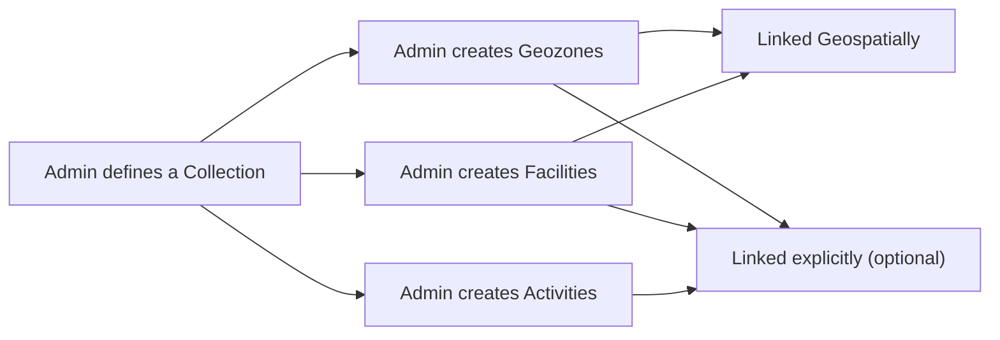
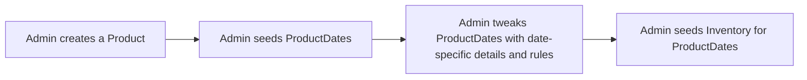
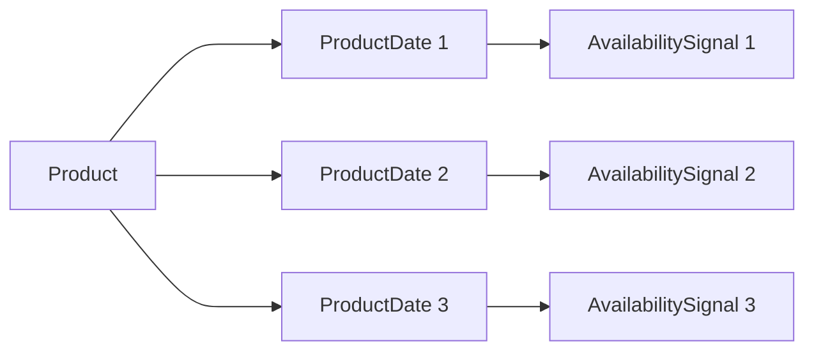
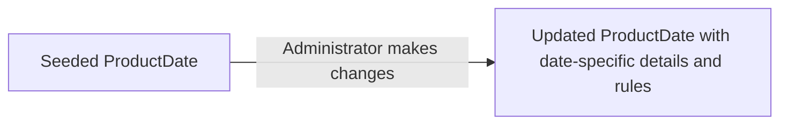
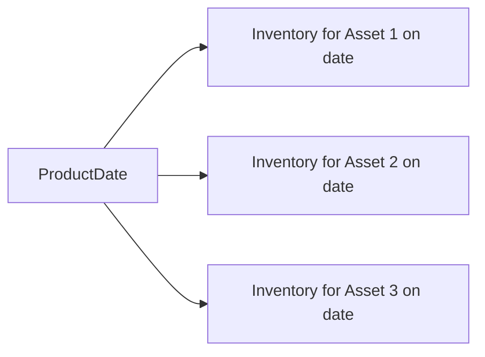
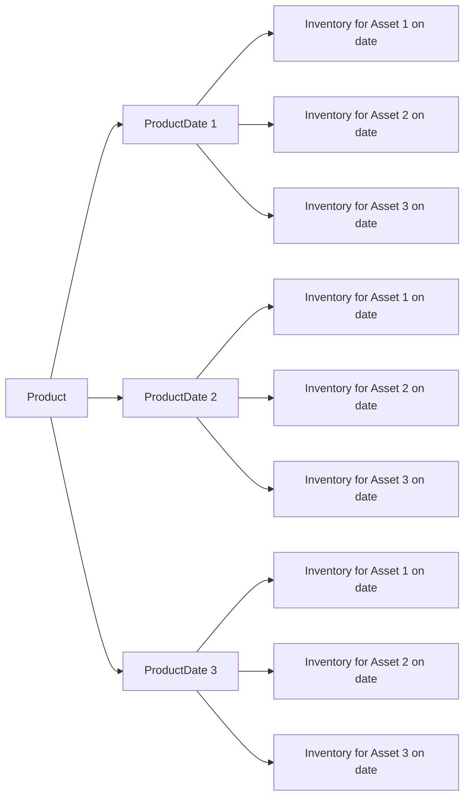

# Admin User Journey Phases

Phases of the admin user journey:

- [Experience Configuration](#experience-configuration): Admins define the spatial, experience, temporal, and governance contexts that make up the offerings.
- [Operational Management](#operational-management): Admins manage inventory, monitor bookings, and adjust operational parameters to ensure smooth functioning of the system.
- [Reporting and Analytics](#reporting-and-analytics): Admins analyze data on bookings, user behaviour, and system performance to inform decision-making and optimize the reservation system.

# Experience Configuration

Administrators set up and configure the various contexts that define the offerings in the reservation system. This includes:

- Defining spatial contexts such as geozones and facilities.
- Creating experience definitions that specify the nature of the offerings, such as Activities and Products.
- Setting temporal availability and concurrency through ProductDates and Inventory.

## Configuring the Spatial Context

Admins define the spatial context by creating and managing geozones, facilities, activities and other spatial concepts. This helps public users in the [Discovery Phase](public-user-journey-phases.md#discovery-phase) understand where experiences are located and what spatial boundaries apply.

## Configuring the Experience Context

Admins create and manage experience definitions through Policies, Products, and ProductDates. This allows them to specify what experiences are offered, how they are structured, and how they evolve over time. By configuring the experience context, admins shape the offerings that users interact with throughout their journey, particularly in the [Alignment Phase](public-user-journey-phases.md#alignment-phase).

Ideally, admins will curate an experience long before it is intended to be discoverable by the public. This allows ample time to configure the spatial, experience, temporal, and governance contexts in a way that creates a seamless and intuitive user journey when the experience is eventually released. The system is optimized for this workflow - the bulk of the work happens upfront and ahead of time, such that the runtime public user experience is fast and intuitive, without any need for complex decisioning or configuration at the moment of booking.

### Creating an Experience

In the beginning of the public user Alignment Phase, public user are matching their experience intent with the available offerings. From a single Activity (experience), administrators can create multiple Products that represent different ways to obtain that experience (offerings). Each Product is a self-contained offering with its own suite of rules and parameters. This allows administrators to create a variety of offerings around a single experience, each with different rules, availability, and constraints.

Products are comprised of rules that apply at different scopes. Some rules apply to the whole offering (time-independent scope), while others apply to specific dates or times (time-dependent scope). By configuring these rules, administrators can create offerings that change in availability, price, or other parameters based on time. This allows for dynamic offerings that can adapt to different days of the week, demand levels, or other operational needs.

Generic rules that govern things like discoverability, reservability, party sizes, fees, cancellation requirements, etc. are defined as Policies and attached to Products at creation time. This allows for consistent application of rules across multiple offerings and simplifies the management of common parameters.

During the lifecycle of the offering, governing rules are resolved as soon as possible. This means that resolved rules are stored with the Product and ProductDate items, rather than refrerencing a Policy and being calculated at runtime. This design choice optimizes for a fast and seamless booking experience for public users, as the system can quickly retrieve pre-resolved rules without needing to perform complex calculations at the moment of booking.

The downside to this approach is that governing structures are difficult to amend once the public user journey has begun, as any changes to the rules would require updating all related Product and ProductDate items with the new resolved values. For this reason, it is critical that administrators carefully configure and review all governing rules during the experience configuration phase, before the offering becomes discoverable to the public.

The following steps are typical in the creation of an offering:

#### Admin creates a Product

- Product is derived from parent Activity and inherits key properties such as `collectionId`, `activityType`, and `activityId`, which are used to construct the partition key for the Product.
- A unique `productId` is generated for each Product, which is used to construct the sort key for the Product and its related items.
- Public-facing Product details such as name and description are defined at this stage, which will be visible to visitors when they discover the offering.
- The timezone is defined, which will be used for all date and time calculations related to the Product.
- A calendar date range is defined, which specifies the initial range of dates for which ProductDates will be seeded.
- The list of Assetsgoverned by the Product and their daily available quantites  is defined, which will be passed to ProductDates and used for Inventory management and availability estimation.
- The `availabilityEstimationPattern` is defined, which specifies how availability should be estimated for ProductDates related to this Product. This pattern will be inherited by the ProductDates and used in availability calculations.
- Itinerary rules are defined, which indicate whether visitors should supply their intended itinerary when making a reservation, including the entry and exit Facilities.
- Waitroom configuration is defined (future state).
- The `allDatesReservedInterval` is defined, which specifies a string of calendar dates within which all reservations of this Product that contain Inventory from those dates must ensure that inventory from ALL of those dates are included in the reservation. This is used to enforce rules around offerings that require continuous inventory across multiple dates (e.g., a multi-day tour that requires inventory on each day of the tour).
- The general reservation policy is linked, which will govern reservation policies for the Product, and be inherited by ProductDates. This policy can be overridden at the ProductDate level if needed.
- From the general reservation policy, the following Product-level values are resolved at Product creation time:
  - `isDiscoverable`: Indicates whether the Product should be visible to visitors during discovery.
  - `isReservable`: Indicates whether the Product can be reserved by visitors.
  - `minTotalDays`: The minimum total days required for a reservation of this Product.
  - `maxTotalDays`: The maximum total days allowed for a reservation of this Product.
  - `temporalWindows.discoveryWindow`: The time window during which the Product is discoverable by visitors, if `isDiscoverable` is true.
- The general booking policy is linked, which will govern booking policies for the Product, and be inherited by ProductDates. This policy can be overridden at the ProductDate level if needed.
- The general fee policy is linked, which will govern fee policies for the Product, and be inherited by ProductDates. This policy can be overridden at the ProductDate level if needed.
- From the general fee policy, any Product-level fee rules are resolved at Product creation time, which will be applied to reservations of this Product. This includes:
  - `feeSchedule`: The schedule of fees that should be applied to reservations of this Product, which may include one-time fees, transaction fees, taxes, and other Product/Booking-level fee types.
  - `lineItems`: The specific line items that should be applied to reservations of this Product, which define how `feeSchedule` fees are applied based on Product/Booking-level details.
- The general change policy is linked, which will govern change policies for the Product, and be inherited by ProductDates. This policy can be overridden at the ProductDate level if needed.

At the end of this stage, the Product item is created, which serves as the parent for all related ProductDate items. The Product contains all the high-level information about the offering, while the ProductDates will contain date-specific information and availability tracking.

#### Admin seeds ProductDates

Once the Product is created, administrators can trigger a ProductDate seed. This action generates one ProductDate item for each date between the `rangeStart` and `rangeEnd` defined on the Product. Each ProductDate inherits key properties from the parent Product and resolves any time-dependent values that are needed for Inventory seeding and vistor discovery/reservation.

- Each ProductDate inherits the partition key and sort key from from the parent Product, which is used to construct the partition key for the ProductDate and its related items.
- The date of which the ProductDate represents is defined, and serves as the ProductDate's sort key.
- An AvailabilitySignal is created for the ProductDate, and the primary key is stored to the ProductDate.
- The list of Assets and their daily available quantities is inherited from the parent Product, and stored on the ProductDate for use in Inventory management and availability estimation.
- If the date falls within an `allDatesReservedInterval`, that interval is stored on the ProductDate to be used in reservation validation for reservations that include inventory from that date.
- The date-specific reservation policy is inherited from the Product, which will govern daily reservation policies for this ProductDate, and be inherited by reservations of this ProductDate. This policy can override the Product-level reservation policy if needed.
 - From the date-specific reservation policy, the following ProductDate-level values are resolved at ProductDate seeding time:
  - `isDiscoverable`: Indicates whether the ProductDate should be visible to visitors during discovery.
  - `isReservable`: Indicates whether the ProductDate can be reserved by visitors.
  - `minDailyInventory`: The minimum daily inventory required for a reservation of this ProductDate.
  - `maxDailyInventory`: The maximum daily inventory allowed for a reservation of this ProductDate
  - `temporalWindows.discoveryWindow`: The time window during which the ProductDate is discoverable by visitors, if `isDiscoverable` is true.
  - `temporalWindows.reservationWindow`: The time window during which this ProductDate can be reserved by visitors, if `isReservable` is true.
  - `temporalWindows.restrictedBookingWindow`: Bookings including Inventory from this ProductDate are banned from making changes/cancellations if they are within this time window, if defined.
- The date-specific booking policy is inherited from the Product, which will govern daily booking policies for this ProductDate, and be inherited by reservations of this ProductDate. This policy can override the Product-level booking policy if needed.
- The date-specific fee policy is inherited from the Product, which will govern daily fee policies for this ProductDate, and be inherited by reservations of this ProductDate. This policy can override the Product-level fee policy if needed.
- From the date-specific fee policy, any ProductDate-level fee rules are resolved at ProductDate seeding time, which will be applied to reservations of this ProductDate. This includes:
  - `feeSchedule`: The schedule of fees that should be applied to reservations of this ProductDate, which may include per-inventory fees, per-day fees, per-party member fees, taxes, and other ProductDate/BookingDate-level fee types.
  - `lineItems`: The specific line items that should be applied to reservations of this ProductDate, which define how `feeSchedule` fees are applied based on Product/Booking-level details.

Note - change policies are independent of time, and therefore do not have ProductDate-level values that need to be resolved at seeding time.

At the end of this stage, the offering is comprised of a Product item that defines the overall offering, and multiple identical ProductDate items, one for each date in the defined date range. Each ProductDate has an associated AvailabilitySignal that is used to track availability changes for that date.

#### ProductDate Enhancements and Adjustments

After the initial ProductDate seeding, administrators can make changes to the ProductDate details as needed. This includes updating the list of Assets and their daily available quantities, changing time-dependent reservation/booking/fee policies, and other date-specific details.

The following properties can be updated during this stage:
- The list of Assets and their daily available quantities can be updated to reflect changes in the offering or inventory levels. This may involve adding new Assets, removing existing Assets, or changing the available quantities for existing Assets.
- Time-dependent reservation policies can be updated to reflect changes in reservation rules or policies. For example, the discovery or reservation windows may be adjusted, or the minimum/maximum inventory requirements may be changed.
- Time dependent booking policies can be updated to reflect changes in booking rules or policies. For example, the allowed daily party compositions and equipment requirements may be changed.
- Time dependent fee policies can be updated to reflect changes in fee rules or policies. For example, a Product may charge more on weekends than weekdays, so the fee schedule may be updated to reflect this, or a new per-party member fee may be added for certain dates.

At the end of this stage, the offering is fully defined. No changes to Product-level or ProductDate-level scope properties can be made after this stage.

#### Administrators seed Inventory

The final stage of experience creation is seeding Inventory for the ProductDates. This involves creating Inventory items for each Asset governed by the Product, for each ProductDate. Each Inventory item represents the intersection of a specific date and the quantity of a specific Asset that is available on that date.

At the end of this stage, the offering is fully available for discovery and reservation by visitors. The Product and ProductDate items define the details of the offering, while the Inventory items define the specific availability of each Asset on each date. The AvailabilitySignal items are used to track changes in availability for each ProductDate, allowing the system to maintain up-to-date availability information for visitors during discovery and reservation.

See [public Alignment Phase](public-user-journey-phases.md#alignment-phase) for how these schemas are used in the public user journey.

**Final Layout**

## Operational Management

Administrators oversee the day-to-day operations of the reservation system, ensuring that it runs smoothly and efficiently. This involves:

- Monitoring inventory levels and adjusting availability as needed.
- Managing bookings and user interactions to resolve issues and provide support.
- Responding to real-time events and making operational adjustments to maintain service quality.

## Reporting and Analytics

Administrators analyze data collected from the reservation system to gain insights and make informed decisions. This includes:

- Tracking booking trends and user behaviour to identify opportunities for improvement.
- Evaluating system performance and identifying areas for optimization.
- Generating reports to inform strategic planning and operational adjustments.
