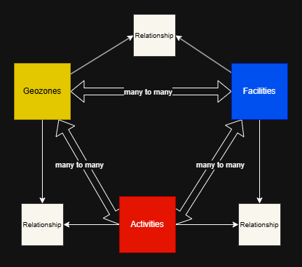

# Data Categorization

The PRDT data model organizes all data into the following categories based on expected read/write intensity. This separation allows DynamoDB tables to be tuned for their specific workload patterns.

## Reference Data
Reference data consists of **long‑lived, persistent, and mostly static** information. It is read frequently and updated infrequently. Reference data is **read‑optimized** and stored in a DynamoDB table configured for high‑read throughput and predictable access patterns.

## Transactional Data
Transactional data consists of **short‑lived, dynamic, and frequently updated** information. It represents user actions or system events that change often. Transactional data is **write‑optimized** and stored in a DynamoDB table configured for high‑write throughput and rapid mutation.

## Relational Data (Future State)
Relational data represents the connections between reference data items rather than the items themselves. These schemas capture two‑way, many‑to‑many relationships as bidirectional adjacency lists. Relational Data is intentionally lightweight and connection‑oriented. Each item expresses a single relationship and contains only the minimal information required to support efficient lookup in both directions. Its access patterns should be balanced: optimized enough to support fast traversal of the graph, but simple enough to remain flexible as the domain evolves. Relationship data does not necessarily need its own DyanmoDB table, but rather intelligently-designed GSIs.

