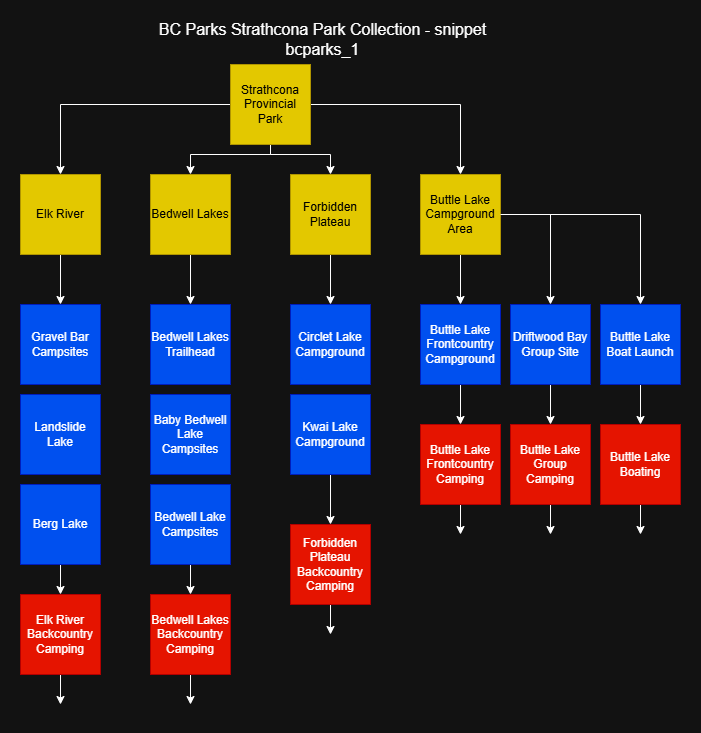
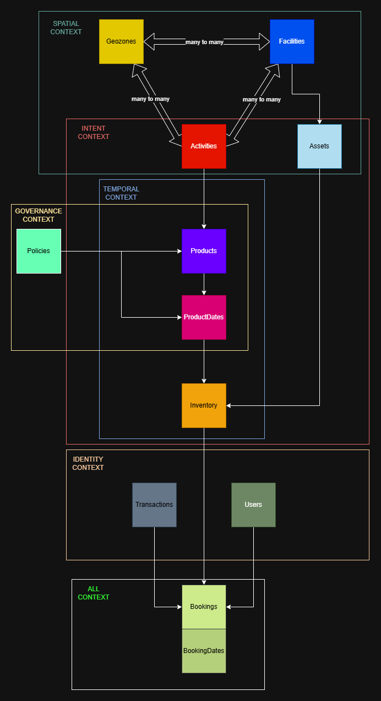

# Reservations Data Model — Summary

Written: 2024-11-15 Updated: 2026-02-11 Author: Team Osprey

The PRDT data model is the foundation that allows BC Parks to offer any kind of outdoor experience — from campsites to cabins, trail passes, backcountry permits, parking, and future offerings we haven’t imagined yet. It’s designed to be flexible, scalable, and easy to maintain as park operations evolve.

At its core, the model separates **where** an experience happens, **what** the experience is, **when** it’s available, **how** it’s governed, and **who** is interacting with it. By keeping these ideas separate, the system can adapt to new experience types, new rules, and new geographies without major redesign.

## Why This Model Exists
BC Parks manages a huge variety of experiences. Most are contained entirely within parks - but some span multiple parks, and some only cover part of a park. Experiences also change seasonally, depend on geospatial boundaries, and require different rules or capacities.

The data model provides a unified structure that can represent all of these cases consistently — even as offerings grow or change.

## [Collections — The Top‑Level Grouping](datatypes/collections.md)
Instead of using legally defined park boundaries (ORCS numbers), the system uses collections — flexible groupings that reflect real‑world operational needs.
A collection may include:
- one park
- multiple parks
- part of a park
- areas that aren’t parks at all

Collections are not a schema or entity (yet) — they’re labels used to group related reference data so the system can reason about an experience domain consistently.

{ align=center }

## [Important Datatypes](../datatypes/)
- [Geozones](../datatypes/geozones.md) - defined spatial boundaries that group assets or regions together so products, rules, and availability can be applied consistently across a specific geographic area.
- [Facilities](../datatypes/facilities.md) - specific, physical elements that describe real-world infrastructure or natural features that visitors interact with directly.
- [Activities](../datatypes/activities.md) - generalized recreational opportunities - such as camping or trail use - that describe what experiences are potentially available to visitors at specific locations without factoring in when they are actually available or which reservation policies apply.
- [Products](../datatypes/products.md)  (WIP) - reservable offerings that define what is being booked along with the general policies and other operational parameters that govern how it can be reserved
- [ProductDates](../datatypes/product-dates.md) (WIP) - fully resolved, day-specific configurations of a product that combine the governing policies into a single authoritative snapshot for that date.
- [AvailabilitySignals](../datatypes/availability-signals.md) (WIP) - lightweight, eventually-consistent, date-specific indicators of whether a product is likely to be available or unavailable, used to optimize search and browsing experiences by avoiding unnecessary inventory queries.
- [Assets](../datatypes/assets.md) (WIP) - persistent logical units - usually physical but sometimes conceptual - that represent something whose ownership or allocation can change day-to-day. The non-temporal part of **inventory**.
- [Inventory](../datatypes/inventory.md) (WIP) - date-specific availability records for an asset, representing the smallest unit of reservable capacity and serving as the concurrency boundary for bookings.
- [Policies](../datatypes/policies/policies-overview.md) (WIP) - define transferrable/shareable rules and conditions that govern how a product can be reserved or modified.
- [Bookings](../datatypes/bookings.md) (WIP) - Records that formalize a user’s commitment to a specific offering by allocating inventory under the governing policies.
- [BookingDates](../datatypes/booking-dates.md) (WIP) - fully resolved, day-specific snapshots of a the governing policies and daily values in single authoritative record for that date, linked to the parent Booking.
- Users (WIP) - Individuals who interact with the system, carrying identity, roles, and permissions that shape what they can see or do.
- [Transactions](../datatypes/transactions.md) (WIP) - Financial records that capture the payment events associated with creating, modifying, or canceling a booking or multiple bookings.
- [(Protected areas)](../datatypes/geozones.md#protected-areas) - a legacy datatype representing a legally-defined park unit, represented in this model as a specialized geozone rather than its own datatype.

{ align=center }

## [The Five Contexts of Every Experience](../contexts/data-contexts.md)
Every experience in the system is described through five independent “contexts.” Each context answers a different question:

#### Spatial Context — “Where does it happen?”
Defines the physical place or region. Definitions include geospatial datapoints.

#### Intent Context — “What is the user doing?” or "What does the user want to do?"
Defines the nature of the experience. This layer is experience‑agnostic, so new experience types can be added without restructuring the rest of the model.

#### Temporal Context — “When is it available?”
Defines schedules and availability. Temporal data changes frequently (seasonally, daily, even hourly), so isolating it keeps the system fast and maintainable.

#### Governance Context — “How is it managed?”
Defines rules, constraints, and operational behaviour. Governance can change independently of location, experience type, or schedule.

#### Identity Context — “Who is interacting with it?”
Defines users, roles, and permissions. Identity influences what people can see or do across all other contexts.

{ align=center }

## [How Data Is Stored](../data-model/data-storage.md)
The model separates data into two major categories:

**Reference Data**
- Long‑lived, mostly static information (e.g., geozones, facilities, activities).
- Stored in a read‑optimized DynamoDB table.

**Transactional Data**
- Short‑lived, frequently updated information (e.g., bookings, user interactions).
- Stored in a write‑optimized DynamoDB table.

**DynamoDB** is the authoritative source of truth, using predictable partition keys for consistent access patterns. DynamoDB excels at structured queries - in other words, if you know what you're looking for, DynamoDB can get it for you cheaply and quickly.

**OpenSearch** is used for:
- full‑text search
- geospatial search
- browsing and discovery

It stays synchronized with DynamoDB through DynamoDB streams. OpenSearch excels where DynamoDB is weak - unstructured, fuzzy searching - and therefore serves as a supplementary data management tool.

In both public and administrative user stories, the system will drive users towards DynamoDB queries as their journey gets more and more specific, but OpenSearch remains to serve broader browsing and discovery use cases.

## In Plain Terms

1. **This system sells experiences. Every experience is made of 5 ingredients: where, what, when, how, and who.**

2. **This model keeps these ingredients independent enough that they can be mixed and matched in any combination, without rewriting the system when something changes.**

3. **This strategic separation is what gives the system its flexibility. If we start blending these ingredients together in the wrong places, we lose extensibility and recreate the old system’s problems.**

The documented KPIs reflect the initial delivery slice (backcountry registrations), but the strategic intent expressed by leadership is to build a unified, extensible reservation platform. This data model was intentionally designed to satisfy both: it supports whichever reservations experience 'slice' must be addressed first, while providing a scalable foundation for all future offerings.

