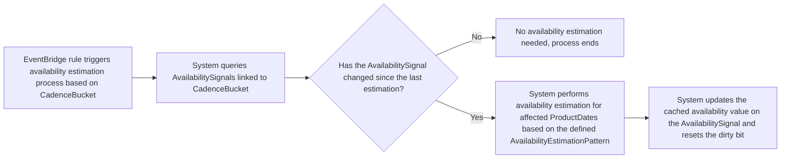

# AvailabilitySignal

An AvailabilitySignal is a tiny, high‑frequency counter that tracks availability on an eventually-consistent basis for a specific ProductDate. If any availability change occurs (inventory is allocated or released), a dirty bit is flipped. On a set cadence, the bit value is checked. If the bit is "dirty", it indicates that availability has changed since the last check, and the system can perform a more comprehensive availability check for that ProductDate and store the result. This allows the system to maintain a cache of availability for ProductDates that is updated in near real-time, without needing to perform expensive availability checks on every request. The AvailabilitySignal serves as a lightweight indicator that triggers more thorough checks only when necessary, improving performance while still providing reasonably up-to-date availability information.

AvailabilitySignals expire after the date of the ProductDate they are associated with, ensuring that stale availability data is not used indefinitely. When a new ProductDate is seeded, a new AvailabilitySignal is also seeded to start tracking availability changes for that date.

Cadence checks are triggered by AWS EventBridge.

## AvailabilitySignal Lifecycle

1. When a new ProductDate is seeded, a corresponding AvailabilitySignal is also seeded. Each AvailabilitySignal is associated with a CadenceBucket that defines how frequently availability checks should occur. The AvailabilitySignal starts with a "clean" state, indicating that no availability changes have occurred since the last check.
2. Whenever an availability change occurs for that ProductDate (e.g., inventory is allocated or released), the dirty bit on the AvailabilitySignal must also be flipped to "dirty" to indicate that availability has changed.
3. Each CadenceBucket corresponds to an AWS EventBridge rule that triggers availability checks on the defined cadence. When the EventBridge rule triggers, it queries for all AvailabilitySignals in the corresponding CadenceBucket. This query is performed by checking the GSI for pk = CadenceBucket ID, and sk = "dirty". For each AvailabilitySignal, it checks the dirty bit. If the bit is "dirty", it performs a comprehensive availability check for the associated ProductDate, updates the cached availability value on the AvailabilitySignal, and resets the dirty bit to "clean". If the bit is not "dirty", it skips the availability check for that ProductDate since no changes have occurred.
4. AvailabilitySignals automatically expire after the date of the ProductDate they are associated with. This is managed by setting an expiry timestamp on the AvailabilitySignal when it is seeded, and a background process can periodically clean up expired signals to prevent stale data from being used.

With this setup, the system can efficiently track availability changes for ProductDates and maintain a cache of availability that is updated in near real-time, while minimizing the performance impact of frequent availability checks.

#### AvailabilitySignal Triggered


#### Availability Estimation Process Triggered by EventBridge Rule



# Properties

## AvailabilitySignal
|property|type|description|derived from|evaluated when|
|---|---|---|---|---|
|`pk`|String|Partition key| "availabilitySignal::\<collectionId>::\<activityType>::\<activityId>::\<productId>"|Inherited from parent ProductDate primary key|
|`sk`|String|Sort key|"\<productDate.sk>"|Inherited from parent ProductDate primary key|
|`gsipk`|String|Global secondary index partition key|CadenceBucket ID|Querying for all AvailabilitySignals on CadenceBucket interval|
|`gsisk`|String|Global secondary index sort key|Dirty bit - Flipped when a change to availability occurs|CadenceBuckets query only for changed availability|
| `schema`|String|Data type/Schema| "availabilitySignal" |Identifying that this item is a "availabilitySignal"|
|`globalId`|String|Globally unique UUID|Automatically generating on AvailabilitySignal seed|Searching for this specific item using the `globalId` GSI|
|`value`|String|Cached availability value for the associated ProductDate|Automatically updating on availability check|Providing a cached availability value that is updated in near real-time based on changes indicated by the `counter`|
|`lastUpdatedAt`|Timestamp|The timestamp of the last cadence check|Automatically updating on cadence check|Recording when the last availability check was performed|
|`availabilityEstimationPattern`|AvailabilityEstimationPattern|Pattern governing how availability is estimated|Inherited from parent Product|Determining how availability is estimated for ProductDates related to this AvailabilitySignal|
|`expiry`|Timestamp|The timestamp when this AvailabilitySignal should be considered expired and deleted|Automatically setting on seed|Ensuring that stale availability data is not kept|

```json
--8<-- "datatypes/examples/availability-signal1.json"
```