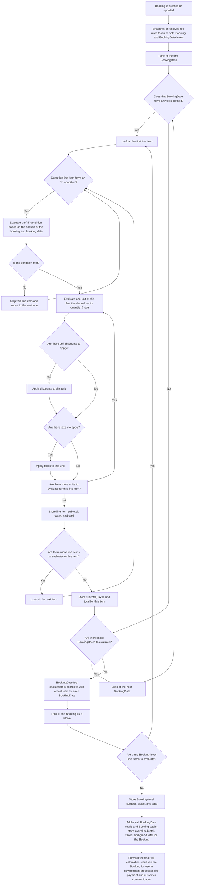

# Fee Policy

|property|type|description|derived from|evaluated when|
|---|---|---|---|---|
|`pk`|String|Partition key| "policy::\<policyType>::\<policyId>"|Searching all versions of this policy|
|`sk`|String|Sort key| "v\<policyIdVersion>" OR "latest" |Searching for a specific version of this policy|
|`gsipk`|String|Global secondary index partition key| Reserved | Reserved |
|`gsisk`|String|Global secondary index sort key| Reserved | Reserved |
| `schema`|String|Data type/Schema| "policy" |Identifying that this item is a "policy"|
|`globalId`|String|Globally unique UUID|Automatically generating on policy creation|Searching for this specific item using the `globalId` GSI|
|`policyType`|String|The type of policy| "party" |Searching for all policies of this type|
|`policyId`|String|A unique identifier for this policy, specific to the policy type|Automatically generating on policy creation|Searching for all versions of this specific policy|
|`policyIdVersion`|Number|The version number of this policy|Automatically incrementing on policy update|Searching for a specific version of this policy|
|`isLatest`|Boolean|Whether this is the latest version of the policy|Automatically setting on policy update|Searching for the latest version of this policy|
|`displayName`|String|A human-readable name for this policy|Provided on policy creation and update|Displaying this policy in a user interface|
|`description`|String|A human-readable description of this policy|Provided on policy creation and update|Displaying this policy in a user interface|
|`productRules`|[FeeProductRules](#feeproductrules)|The rules that govern how this policy is applied at the Product level|Provided on policy creation and update|Evaluating whether a Product complies with the rules defined in this policy|
|`productDateRules`|[FeeProductDateRules](#feeproductdaterules)|The rules that govern how this policy is applied at the ProductDate level|Provided on policy creation and update|Evaluating whether a ProductDate complies with the rules defined in this policy|
|`createdAt`|Timestamp|The timestamp when this policy was created|Automatically setting on policy creation|Tracking when this policy was created|
|`lastUpdated`|Timestamp|The timestamp when this policy was last updated|Automatically updating on policy update|Tracking when this policy was last updated|

## FeeProductRules

|property|type|description|derived from|evaluated when|
|---|---|---|---|---|
|`feeSchedule`|[[FeeDefinition](#feedefinition)]|The snapshot of the fee schedule applied to this Booking at the time of booking|Derived from parent Product's referenced Fee Policy at the time of booking|Capturing the specific fee schedule for this Booking based on the Product's Fee Policy at the moment it was created|
|`lineItems`|[LineItem](#lineitem)|The snapshot of the fee line items applied to this Booking at the time of booking|Derived from parent Product's referenced Fee Policy and client input on Booking POST at the time of booking|Capturing the specific fee line items for this Booking based on the Product's Fee Policy and customer input at the moment it was created|

### FeeProductDateRules

|property|type|description|derived from|evaluated when|
|---|---|---|---|---|
|`feeSchedule`|[[FeeDefinition](#feedefinition)]|The snapshot of the fee schedule applied to this Booking at the time of booking|Derived from parent Product's referenced Fee Policy at the time of booking|Capturing the specific fee schedule for this Booking based on the Product's Fee Policy at the moment it was created|
|`lineItems`|[LineItem](#lineitem)|The snapshot of the fee line items applied to this Booking at the time of booking|Derived from parent Product's referenced Fee Policy and client input on Booking POST at the time of booking|Capturing the specific fee line items for this Booking based on the Product's Fee Policy and customer input at the moment it was created|

### FeeDefinition

A single component of a fee schedule that defines a specific fee that can be applied to bookings of a Product. FeeSchedules are made up of multiple FeeDefinitions.

|property|type|description|derived from|evaluated when|
|---|---|---|---|---|
|`id`|String|Unique identifier for the fee component|Administrators on FeePolicy PUT/POST|Distinguishing this fee component from others in the same fee schedule|
|`label`|String|Human-readable label for the fee component|Administrators on FeePolicy PUT/POST|Providing a public facing, human-readable title of this fee component|
|`type`|String|Type of fee (e.g., "flat", "percentage", "unit")|Administrators on FeePolicy PUT/POST|Determining how this fee component is intended to be utilized|
|`amount`|Number|The base amount for the fee component|Administrators on FeePolicy PUT/POST|Determining the base amount used in calculations for this fee component|

### LineItem

A single line item that defines how a fee is calculated and applied to bookings of a Product. LineItems are made up of multiple calculation steps that reference FeeDefinitions from the FeeSchedule, or other LineItems. When provided as part of a ProductFeePolicyRef, LineItems define how to charge for the Product at a Product level. These line items will be supplemented by additional line items defined at the ProductDate level when seeding.

LineItems only need to be present on the Product if the system is to provide a Product-level fee estimate prior to selecting specific dates. Otherwise, they can remain on the FeePolicy to resolved at reservation time.

|property|type|description|derived from|evaluated when|
|---|---|---|---|---|
|`id`|String|Unique identifier for the line item|Administrators on FeePolicy PUT/POST|Distinguishing this line item from others in the same fee policy|
|`label`|String|Human-readable label for the line item|Administrators on FeePolicy PUT/POST|Providing a public facing, human-readable title of this line item|
|`type`|String|The type of line item (e.g., "flat", "unit")|Administrators on FeePolicy PUT/POST|Determining how this line item is processed in the overall fee calculation|
|`role`|String|The role of this line item (e.g., "total", "subTotal", "tax")|Administrators on FeePolicy PUT/POST|Categorizing this line item for internal processing and reporting|
|`tags?`|[String]|Optional tags associated with this line item|Administrators on FeePolicy PUT/POST|Categorizing or labeling this line item for easier identification and conditional UI rendering|
|`if`|[ComparisonPrimitive]|Optional conditions that must be met for this line item to be applied|Administrators on FeePolicy PUT/POST|Determining if this line item should be applied based on booking context|
|`quantity`|ReferencePrimitive|The quantity used in calculating this line item. `type = flat` means `quantity` is automatically 1|Administrators on FeePolicy PUT/POST|Determining the quantity factor used in calculating this line item|
|`rate`|ReferencePrimitive|The rate used in calculating this line item. `type = unit` means `rate` is applied per unit|Administrators on FeePolicy PUT/POST|Determining the rate factor used in calculating this line item|
|`taxApplied?`|[ReferencePrimitive]|Optional list of taxes applied to this line item|Administrators on FeePolicy PUT/POST|Determining which taxes are applied per-unit or flatly to this line item|
|`discountsApplied?`|[ReferencePrimitive]|Optional list of discounts applied to this line item|Administrators on FeePolicy PUT/POST|Determining which discounts are applied per-unit or flatly to this line item|
|`isReturnable`|Boolean|Whether this line item is eligible for return/refund|Administrators on FeePolicy PUT/POST|Determining if this line item can be refunded during a return process|

#### Fee Calculation Flow

