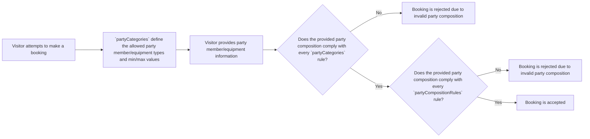

# Party Policy

|property|type|description|derived from|evaluated when|
|---|---|---|---|---|
|`pk`|String|Partition key| "policy::\<policyType>::\<policyId>"|Searching all versions of this policy|
|`sk`|String|Sort key| "v\<policyIdVersion>" OR "latest" |Searching for a specific version of this policy|
|`gsipk`|String|Global secondary index partition key| Reserved | Reserved |
|`gsisk`|String|Global secondary index sort key| Reserved | Reserved |
| `schema`|String|Data type/Schema| "policy" |Identifying that this item is a "policy"|
|`globalId`|String|Globally unique UUID|Automatically generating on policy creation|Searching for this specific item using the `globalId` GSI|
|`policyType`|String|The type of policy| "party" |Searching for all policies of this type|
|`policyId`|String|A unique identifier for this policy, specific to the policy type|Automatically generating on policy creation|Searching for all versions of this specific policy|
|`policyIdVersion`|Number|The version number of this policy|Automatically incrementing on policy update|Searching for a specific version of this policy|
|`isLatest`|Boolean|Whether this is the latest version of the policy|Automatically setting on policy update|Searching for the latest version of this policy|
|`displayName`|String|A human-readable name for this policy|Provided on policy creation and update|Displaying this policy in a user interface|
|`description`|String|A human-readable description of this policy|Provided on policy creation and update|Displaying this policy in a user interface|
|`refStore`|[ReferenceStore](#referencestore)|The reference store that contains any additional data needed to evaluate this policy|Provided on policy creation and update|Accessing additional data needed to evaluate this policy|
|`productRules`|[PartyProductRules](#partyproductrules)|The rules that govern how this policy is applied at the Product level|Provided on policy creation and update|Evaluating whether a Product complies with the rules defined in this policy|
|`createdAt`|Timestamp|The timestamp when this policy was created|Automatically setting on policy creation|Tracking when this policy was created|
|`lastUpdated`|Timestamp|The timestamp when this policy was last updated|Automatically updating on policy update|Tracking when this policy was last updated|

## PartyProductRules

|property|type|description|derived from|evaluated when|
|---|---|---|---|---|
|`partyCategories`|[[PartyCategory]](#partycategory)|The rules governing what types of party members/equipment can be included in a booking and what the minimum and maximum value for each type of party member/equipment is|Provided on policy creation and update|Evaluating whether a Product complies with the party composition rules defined in this policy|
|`partyCompositionRules`|[[ElegibilityPrimitive](#eligibilityprimitive)]|The rules governing what combinations of party members/equipment can be included in a booking|Provided on policy creation and update|Evaluating whether a Product complies with the party composition rules defined in this policy|

### PartyCategory

|property|type|description|derived from|evaluated when|
|---|---|---|---|---|
|`id`|String|The unique identifier for this party category|Derived from parent Product's Party Policy|Identifying this specific party category|
|`label`|String|The display name for this party category|Derived from parent Product's Party Policy|Providing a human-readable name for this party category|
|`minCount`|Number|The minimum number of party members/equipment that must be included in a booking for this category|Derived from parent Product's Party Policy|Enforcing the minimum count for this party category in bookings|
|`maxCount`|Number|The maximum number of party members/equipment that can be included in a booking for this category|Derived from parent Product's Party Policy|Enforcing the maximum count for this party category in bookings|

#### `partyCategories` and `partyCompositionRules`

