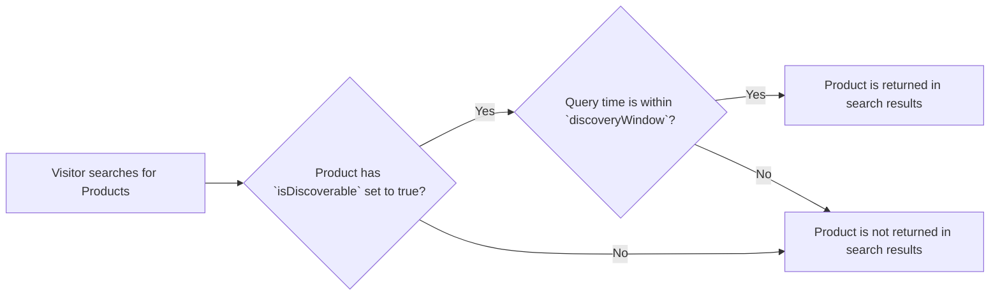
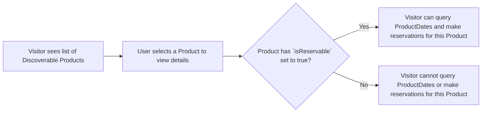
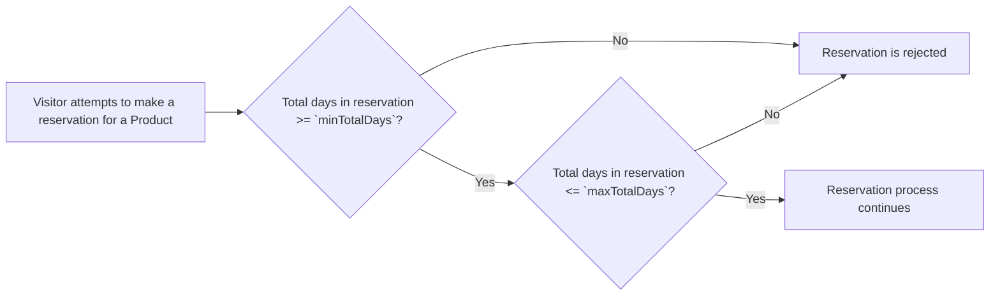
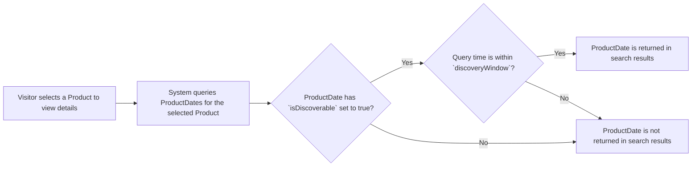
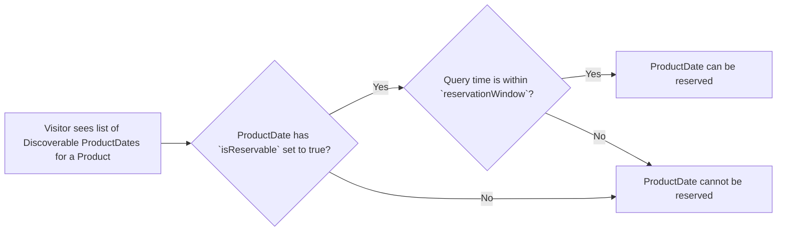
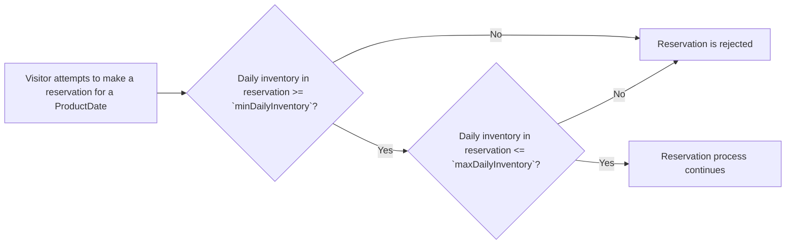
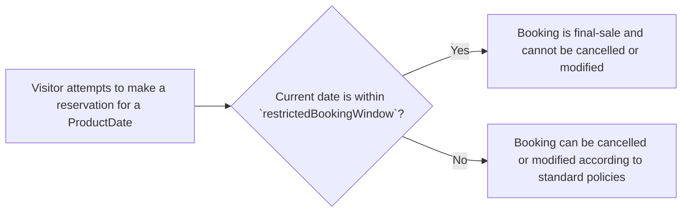

# Reservation Policy

|property|type|description|derived from|evaluated when|
|---|---|---|---|---|
|`pk`|String|Partition key| "policy::\<policyType>::\<policyId>"|Searching all versions of this policy|
|`sk`|String|Sort key| "v\<policyIdVersion>" OR "latest" |Searching for a specific version of this policy|
|`gsipk`|String|Global secondary index partition key| Reserved | Reserved |
|`gsisk`|String|Global secondary index sort key| Reserved | Reserved |
| `schema`|String|Data type/Schema| "policy" |Identifying that this item is a "policy"|
|`globalId`|String|Globally unique UUID|Automatically generating on policy creation|Searching for this specific item using the `globalId` GSI|
|`policyType`|String|The type of policy| "reservation" |Searching for all policies of this type|
|`policyId`|String|A unique identifier for this policy, specific to the policy type|Automatically generating on policy creation|Searching for all versions of this specific policy|
|`policyIdVersion`|Number|The version number of this policy|Automatically incrementing on policy update|Searching for a specific version of this policy|
|`isLatest`|Boolean|Whether this is the latest version of the policy|Automatically setting on policy update|Searching for the latest version of this policy|
|`displayName`|String|A human-readable name for this policy|Provided on policy creation and update|Displaying this policy in a user interface|
|`description`|String|A human-readable description of this policy|Provided on policy creation and update|Displaying this policy in a user interface|
|`refStore`|[ReferenceStore](#referencestore)|The reference store that contains any additional data needed to evaluate this policy|Provided on policy creation and update|Accessing additional data needed to evaluate this policy|
|`productRules`|[ReservationProductRules](#reservationproductrules)|The rules that govern how this policy is applied at the Product level|Provided on policy creation and update|Evaluating whether a Product complies with the rules defined in this policy|
|`productDateRules`|[ReservationProductDateRules](#reservationproductdaterules)|The rules that govern how this policy is applied at the ProductDate level|Provided on policy creation and update|Evaluating whether a ProductDate complies with the rules defined in this policy|
|`createdAt`|Timestamp|The timestamp when this policy was created|Automatically setting on policy creation|Tracking when this policy was created|
|`lastUpdated`|Timestamp|The timestamp when this policy was last updated|Automatically updating on policy update|Tracking when this policy was last updated|

## ReferenceStore

|property|type|description|derived from|evaluated when|
|---|---|---|---|---|
|`user`|[ReferencePrimitive]|Reference primitives related to the user|User making the reservation|Evaluating policies that depend on user attributes|
|`inventory`|[ReferencePrimitive]|Reference primitives related to inventory|Inventory being reserved|Evaluating policies that depend on inventory attributes|
|`temporalAnchors`|[ReferencePrimitive]|Reference primitives related to temporal anchors (e.g., current date)|Current date and time|Evaluating policies that depend on temporal conditions|
|`temporalWindows`|[ReferencePrimitive]|Reference primitives related to temporal windows (e.g., discovery window, reservation window)|Current date and time, Product/ProducDate temporal window definitions|Evaluating policies that depend on whether the current date falls within certain temporal windows|
|`partyCategories`|[ReferencePrimitive]|Reference primitives related to party categories (e.g., adult, child, senior)|Composition of the party included in the reservation|Evaluating policies that depend on the composition of the party making the reservation|

## ReservationProductRules

These rules are scoped to entire Products/Bookings and are independent of when reservations occur. They answer the question: "What policies govern reservations of this offering, regardless of when they occur?"

These will be fully resolved on the Product.

Some policies may be abstract enough to be grouped into reusable modules across Products, while others may be specific enough to be defined singularly and exclusively to the Product. Reservation Policies aim to capture the former.

|property|type|description|derived from|evaluated when|
|---|---|---|---|---|
|`isDiscoverable`|Boolean|Is the Product discoverable? If yes, it can be returned in search results. If no, it will not be returned in search results.|Provided on policy creation and update|Evaluating whether a Product is discoverable based on this policy|
|`isReservable`|Boolean|Is the Product reservable? If yes, ProductDates can be queried. If no, it ProductDates cannot be queried and no reservations can be made.|Provided on policy creation and update|Evaluating whether a Product is reservable based on this policy|
|`minTotalDays`|Number|What is the minimum total number of days that must be included in a reservation of this Product?|Provided on policy creation and update|Evaluating whether a reservation meets the minimum total days requirement based on this policy|
|`maxTotalDays`|Number|What is the maximum total number of days that can be included in a reservation of this Product?|Provided on policy creation and update|Evaluating whether a reservation meets the maximum total days requirement based on this policy|
|`holdDuration`|Duration|How long can a reservation of this Product be held before it expires?|Provided on policy creation and update|Evaluating whether a reservation hold has expired based on this policy|
|`availabilityEstimationPattern`|[AvailabilityEstimationPattern](#availabilityestimationpattern)|What pattern governs how availability is estimated for ProductDates related to this Product?|Provided on policy creation and update|Determining how availability is estimated for ProductDates related to this Product based on this policy|
|`temporalWindows`|[ProductTemporalWindows](#producttemporalwindows)|The temporal windows that govern when this Product is discoverable and reservable|Provided on policy creation and update|Evaluating whether a Product is discoverable and reservable based on the current date and the temporal windows defined in this policy|

## AvailabilityEstimationPattern

An AvailabilityEstimationPattern defines the pattern used to estimate availability for ProductDates related to a Product. This pattern helps in providing an eventually-consistent estimate of availability for booking on each date.

ProductDates are high-traffic items that are read-optimized. To keep an accurate availability count on each ProductDate would require a write operation on every booking, which could lead to performance issues. Instead, the system uses an eventually-consistent approach to availability estimation, where availability is estimated based on a defined pattern and updated on a regular cadence.

Each ProductDate generates a tiny, cheap, high-frequency [AvailabilitySignal](#availabilitysignal) item. When availability for that date is affected, the AvailabilitySignal makes note. Then, on a cadence defined by AvailabilityEstimationPattern, a cronjob process will read the AvailabilitySignal, and if a change has occured perform a more rigorous availability estimate. This allows the system to provide a reasonably up-to-date estimate of availability without needing to perform expensive write operations on the ProductDate for every booking. Additionally, the estimation check does not occur if the AvailabilitySignal has not changed since the last estimate, which helps to further reduce unnecessary processing during periods of low traffic.

If `estimationMode` is set to "exact", the system will provide a count of available items on the cadence increment. If `estimationMode` is set to "tiered", the system will provide a tier of availability (e.g., "high", "medium", "low") based on thresholds defined in the AvailabilityEstimationPattern.

|property|type|description|derived from|evaluated when|
|---|---|---|---|---|
|`estimationMode`|String|The mode of availability estimation (e.g., "exact", "tiered")|Administrators on Product PUT/POST|Determining the mode of availability estimation for ProductDates related to this Product|
|`cadence`|[CadenceBucket](#cadencebucket)|The frequency at which availability estimation should occur (e.g., every 5 minutes)|Administrators on Product PUT/POST|Determining how often availability estimation should occur for ProductDates related to this Product|
|`tiers?`|[AvailabilityTier](#availabilitytier)|Optional ordered array of availability tiers with thresholds, used if `estimationMode` is set to "tiered"|Administrators on Product PUT/POST|Defining the availability tiers and their corresponding thresholds for tiered availability estimation|

### CadenceBucket

A CadenceBucket defines the frequency at which availability estimation should occur for ProductDates related to a Product. The system will trigger availability estimation checks on the associated ProductDates at intervals defined by the CadenceBucket. Each CadenceBucket corresponds to an AWS EventBridge rule that triggers the availability estimation process on the defined cadence. For example, if a Product has a cadence of "5min", the system will perform availability estimation checks for its ProductDates every 5 minutes. All Products of the same CadenceBucket can be processed in a single batch job triggered by the corresponding EventBridge rule, allowing for efficient handling of availability estimation across multiple Products.

|property|type|description|derived from|evaluated when|
|---|---|---|---|---|
|`id`|String|Unique identifier for the cadence bucket|Administrators on Product PUT/POST|Distinguishing this cadence bucket from others in the same estimation pattern|
|`label`|String|The label for this cadence bucket (e.g., "5min", "15min", "30min")|Administrators on Product PUT/POST|Providing a human-readable label for this cadence bucket|

### AvailabilityTier

|property|type|description|derived from|evaluated when|
|---|---|---|---|---|
|`id`|String|Unique identifier for the availability tier|Administrators on Product PUT/POST|Distinguishing this availability tier from others in the same estimation pattern|
|`label`|String|The label for this availability tier (e.g., "high", "medium", "low")|Administrators on Product PUT/POST|Providing a human-readable label for this availability tier|
|`maxPercentage`|Number|The maximum percentage of availability for this tier (e.g., 0.7 for 70%)|Administrators on Product PUT/POST|Determining the upper threshold of availability for this tier in tiered availability estimation|

#### Product level `isDiscoverable` and `discoveryWindow`

#### Product level `isReservable`

#### `minTotalDays` and `maxTotalDays`

### ProductTemporalWindows

Below are the mandatory temporal windows that must be defined for a reservation policy. Additional temporal windows can be added as needed.

|property|type|description|derived from|evaluated when|
|---|---|---|---|---|
|`discoveryWindow`|TemporalWindow|If the Product is discoverable, what is the temporal window for which it should be discoverable?|Provided on policy creation and update|Evaluating whether a Product is discoverable based on the current date and the discovery window defined in this policy|

## ReservationProductDateRules

These rules are scoped to ProductDates/BookingDates and can change day-to-day. They answer the question: "What policies that govern reservations of this offering depend on when when a particular action occur?"

|property|type|description|derived from|evaluated when|
|---|---|---|---|---|
|`isDiscoverable`|Boolean|Is the ProductDate discoverable? If yes, it can be returned in search results. If no, it will not be returned in search results.|Provided on policy creation and update|Evaluating whether a ProductDate is discoverable based on this policy|
|`isReservable`|Boolean|Is the ProductDate reservable? If yes, reservations can be made for that date. If no, reservations cannot be made for that date.|Provided on policy creation and update|Evaluating whether a ProductDate is reservable based on this policy|
|`minDailyInventory`|Number|What is the minimum Inventory quanitity that Bookings must reserve for this ProductDate?|Provided on policy creation and update|Evaluating whether a reservation meets the minimum daily inventory requirement based on this policy|
|`maxDailyInventory`|Number|What is the maximum Inventory quanitity that can be reserved for this ProductDate?|Provided on policy creation and update|Evaluating whether a reservation meets the maximum daily inventory requirement based on this policy|
|`temporalWindows`|[ProductDateTemporalWindows](#productdatetemporalwindows)|The temporal windows that govern when this ProductDate is discoverable and reservable|Provided on policy creation and update|Evaluating whether a ProductDate is discoverable and reservable based on the current date and the temporal windows defined in this policy|

#### ProductDate level `isDiscoverable` and `discoveryWindow`

#### ProductDate level `isReservable` and `reservationWindow`

#### `minDailyInventory` and `maxDailyInventory`

### ProductDateTemporalWindows

Below are the mandatory temporal windows that must be defined for a reservation policy. Additional temporal windows can be added as needed.

|property|type|description|derived from|evaluated when|
|---|---|---|---|---|
|`discoveryWindow`|TemporalWindow|If the ProductDate is discoverable, what is the temporal window for which it should be discoverable?|Provided on policy creation and update|Evaluating whether a ProductDate is discoverable based on the current date and the discovery window defined in this policy|
|`reservationWindow`|TemporalWindow|What is the temporal window for which reservations can be made for this ProductDate?|Provided on policy creation and update|Evaluating whether reservations can be made for this ProductDate based on the current date and the reservation window defined in this policy|
|`restrictedBookingWindow`|TemporalWindow|What is the temporal window for which bookings of this ProductDate are final-sale?|Provided on policy creation and update|Evaluating whether bookings of this ProductDate are final-sale based on the current date and the restricted booking window defined in this policy|

#### `restrictedBookingWindow`

